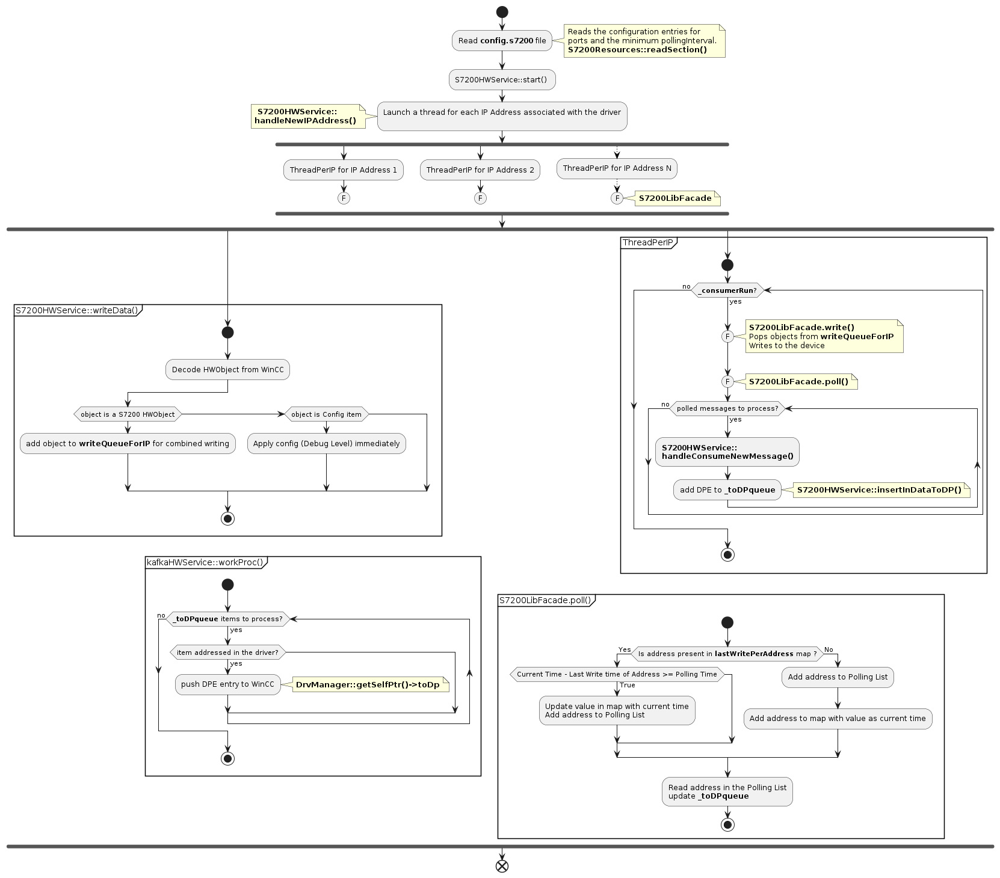

CERN HSE Computing  (HSE-TS-CS)
==================================================

Contact email: hse-cen-co@cern.ch

WinCC OA S7200 Driver
==================================================


# Table of contents #
1. [Description](#toc1)
2. [Libraries](#toc2)

3. [Compilation](#toc3)
    
    3.1. [To build the driver](#toc3.1)

    3.2. [To Install](#toc3.2)

    3.3. [Run](#toc3.3)

4. [Config file](#toc4)

5. [WinCC OA Installation](#toc5)

6. [S7200 Driver Technical Documentation](#toc6)

    6.1. [Main entry points](#toc6.1)

    6.2. [Addressing DPEs with the S7200 driverl](#toc6.2)

    * 6.2.1 [Data types](#toc6.2.1)
    * 6.2.2 [Adding a new type](#toc6.2.4)

    6.3 [Driver configuration](#toc6.3)

    6.4 [Activity diagram](#toc6.4)


<a name="toc1"></a>

# 1. Description #

This WinCC OA driver enables bidirectional data transfer between S7200 devices and the WinCCOA environment, with support for multiple polling intervals and consolidated write functions. 

Additionally, the driver offers compatibility with multiple IP addresses, making it a versatile and reliable tool for data integration.


<a name="toc2"></a>

# 2. Libraries #

* C++11 STL
* WinCC OA API libraries
* Snap7 


<a name="toc3"></a>

# 3. Compilation:
Project has a Makefile. Note that you can also set the `PVSS_PROJ_PATH` environment variable beforehand. 

<a name="toc3.1"></a>

## 3.1 To build the driver

	make

<a name="toc3.2"></a>

## 3.2 To install

	make install PVSS_PROJ_PATH=<path_to_pvss_project_bin_folder>
    

<a name="toc3.3"></a>

## 3.3 Run

It can be run from the WinCCOA Console or from command line and it will require the `config.S7200` file:

    ./WINCCOAS7200Drv -num <driver_number> -proj <project_name> +config config.S7200

<a name="toc4"></a>

# 4. Config file #

The `config.S7200` file has to be present under the WinCCOA project folder `config`.

When configuring the file, it is necessary to specify the local and remote TSAP ports, as well as the minimum polling interval required for seamless communication between the WinCCOA environment and external devices or systems.

Here is an example config file:
```
[S7200]
# Define local TSAP port 
localTSAP = 0x1401

# Define remote TSAP port 
remoteTSAP = 0x1400

# Define polling Interval
pollingInterval = 3
```

<a name="toc5"></a>

# 5. WinCC OA Installation #

Under the [winccoa folder](./winccoa/) you will find the following files that you need to copy to your project in the corresponding paths:

* [dplist/S7200_driver_config.dpl](./winccoa/dplist/S7200_driver_config.dpl) : it contains `internal driver & CONFIG_S7200 DPs`. Once you've successfully launched the driver in the WinCC project manangement, you can import it via the ASCII Manager(refer to the official WinCC OA Documentation).

Notes:

    * This is a specific dump of the REMUS redundant project DPs 
    * The internal driver number in the dump is 14. If it's unavailable to you, try to modify the dump file directly. 

* [dplist/panels/para/address_S7200.pnl](./winccoa/panels/para/address_S7200.pnl) : a panel that you can use in para for S7200 addressing. If you install this panel, then you will also need the WinCC OA scripts that go along:

    * [scripts/userDrivers.ctl](./winccoa/scripts/userDrivers.ctl)
    * [scripts/userPara.ctl](./winccoa/scripts/userPara.ctl)


See [6.3 Driver configuration](#toc6.3) section for a brief descprition of relevant CONFIG_S7200 DPEs.


<a name="toc6"></a>

# 6. S7200 Driver Technical Documentation #

<a name="toc6.1"></a>

## 6.1 Main entry points ##
After the driver startup, the main entry points in the driver are:
    
* S7200HwService::writeData() -> WinCC to Driver communication

    This is how the S7200 streaming is performed. Thanks to the addressing `<TOPIC>$<KEY>[$<DEBOUNCING_TIMEFRAME>]`, the driver will be able to stream to the right topic.

* S7200HwService::workProc()  -> Driver to WinCC communication

    This is how we push data to WinCC from S7200. Thanks to the addressing `<TOPIC>$<KEY>`,the driver will be able to map the data ingested from the respective S7200 topic to the WinCC DPE.

Please refer to the WinCC documentation for more information on the WinCC OA API. 
For more info on the debouncing, see [Remus RealTime Evolution - S7200 presentation](./doc/REMUS_RealTime_Evolution_-_S7200.pptx).

<a name="toc6.2"></a>

## 6.2 Addressing DPEs with the S7200 driver ##

<a name="toc6.2.1"></a>

### 6.2.1 Data Types ###
When the S7200 driver pushes a DPE value to WinCC, a transformation takes place. See [Transformations folder](./Transformations). We are currently supporting the following data types for the periphery address:

--------------------------------------------------------------------------------------------------------------------------------
| WinCC DataType    | Transformation class                                          | Periphery data type value                 |
| ------------------| --------------------------------------------------------------| ----------------------------------------- |
| bool              | [S7200BoolTrans.cxx](./Transformations/S7200BoolTrans.cxx)    | 1000 (TransUserType def in WinCC OA API)  |
| uint8             | [S7200Uint8Trans.cxx](./Transformations/S7200Uint8Trans.cxx)  | 1001 (TransUserType + 1)                  |
| int32             | [S7200Int32Trans.cxx](./Transformations/S7200Int32Trans.cxx)  | 1002 (TransUserType + 2)                  |
| int64             | [S7200Int64Trans.cxx](./Transformations/S7200Int64Trans.cxx)  | 1003 (TransUserType + 3)                  |
| float             | [S7200FloatTrans.cxx](./Transformations/S7200FloatTrans.cxx)  | 1004 (TransUserType + 4)                  |
| string            | [S7200StringTrans.cxx](./Transformations/S7200StringTrans.cxx)| 1005 (TransUserType + 5)                  |
--------------------------------------------------------------------------------------------------------------------------------

<a name="toc6.2.2"></a>

### 6.2.2 Adding a new transformation ###

To add a new transformation you need to do the following: 

* create a define in `S7200HWMappeer.hxx`

        #define S7200DrvDoubleTransType (TransUserType + 7)
 
* handle the new transformation type in `S7200HWMapper::addDpPa()`
* implement the transformation type class. The important functions here are 
    
    * `::toPeriph(...)`  for WinCC OA to S7200 driver transformation
    * `::toVar(...)`   for S7200 driver to WinCC OA transformation


<a name="toc6.3"></a>

## 6.3 Driver Configuration ##

Available via the WinCC OA `CONFIG_S7200` DataPoint, we have the following 

| Config DPE                | Direction    | Addressing                    | Type      | Description                                                                        |
| -------------             | ---------    | -------------                 | --------- | -------------                                                                      |
| DebugLvl                  | OUT          | DEBUGLVL                      | INT32     | Debug Level for logging. You can use this to debug issues. (default 1)             |
| Driver Version            | IN           | VERSION                       | STRING    | The driver version                                                                 |


<a name="toc6.4"></a>

## 6.4 Activity Diagram ##


